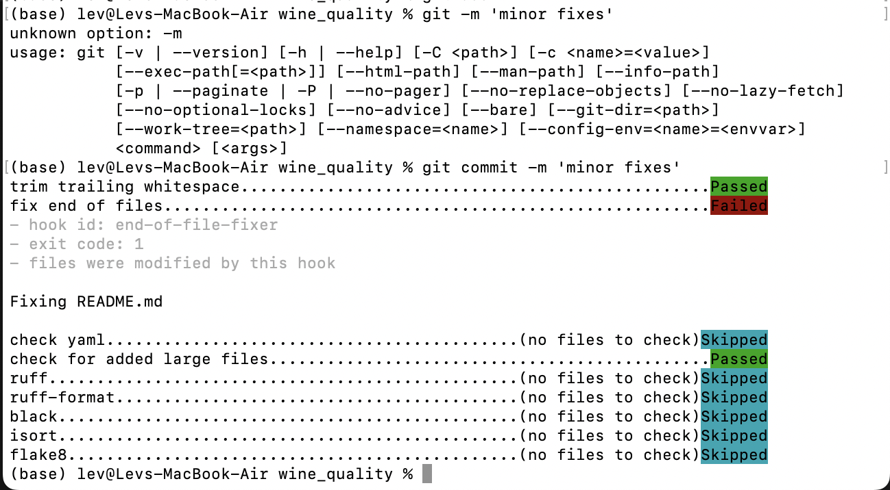

# wine_quality

<a target="_blank" href="https://cookiecutter-data-science.drivendata.org/">
    
</a>

project to asses wine quality

## Project Organization

```
├── LICENSE            <- Open-source license if one is chosen
├── Makefile           <- Makefile with convenience commands like `make data` or `make train`
├── README.md          <- The top-level README for developers using this project.
├── data
│   ├── external       <- Data from third party sources.
│   ├── interim        <- Intermediate data that has been transformed.
│   ├── processed      <- The final, canonical data sets for modeling.
│   └── raw            <- The original, immutable data dump.
│
├── docs               <- A default mkdocs project; see www.mkdocs.org for details
│
├── models             <- Trained and serialized models, model predictions, or model summaries
│
├── notebooks          <- Jupyter notebooks. Naming convention is a number (for ordering),
│                         the creator's initials, and a short `-` delimited description, e.g.
│                         `1.0-jqp-initial-data-exploration`.
│
├── pyproject.toml     <- Project configuration file with package metadata for
│                         src and configuration for tools like black
│
├── references         <- Data dictionaries, manuals, and all other explanatory materials.
│
├── reports            <- Generated analysis as HTML, PDF, LaTeX, etc.
│   └── figures        <- Generated graphics and figures to be used in reporting
│
├── requirements.txt   <- The requirements file for reproducing the analysis environment, e.g.
│                         generated with `pip freeze > requirements.txt`
│
├── setup.cfg          <- Configuration file for flake8
│
└── src   <- Source code for use in this project.
    │
    ├── __init__.py             <- Makes src a Python module
    │
    ├── config.py               <- Store useful variables and configuration
    │
    ├── dataset.py              <- Scripts to download or generate data
    │
    ├── features.py             <- Code to create features for modeling
    │
    ├── modeling
    │   ├── __init__.py
    │   ├── predict.py          <- Code to run model inference with trained models
    │   └── train.py            <- Code to train models
    │
    └── plots.py                <- Code to create visualizations
```

--------
### Отчет о настройке рабочего места Data Scientist (ДЗ1)
#### 1. Структура проекта:
Использован [Cookiecutter DS](https://cookiecutter-data-science.drivendata.org/)
```
pip install cookiecutter-data-science
ccds
```
Создан подробный README.md, включающий:
Описание проекта
Структуру проекта
Инструкции по установке
Руководство по использованию
Описание инструментов качества кода

#### 2.Качество кода :
Настроены pre-commit hooks: Black, isort, Ruff, MyPy, Bandi
Настроено форматирование кода (Black, isort, Ruff)
Настроить линтеры (Ruff, MyPy, Bandit)
Созданы конфигурационные файлы

#### 3.Управление зависимостями:
Настрено управлнеие зависимостями с Poetry
Создан requirements.txt с точными версиями
Настроено виртуальное окружение c Poetry
Создан Dockerfile для контейнеризации

#### 4.Git workflow :
Настроием Git репозиторий
Создан .gitignore для ML проекта
Настроены ветки для разных этапов работы

#### 5. Отчет о проделанной работе
