# wine_quality

<a target="_blank" href="https://cookiecutter-data-science.drivendata.org/">
    
</a>

project to asses wine quality

# Table of contents
- [1. Project Organization](#Project-Organization)
- [2. How to run](#How-to-run)
- [3. Отчеты]()
  - [3.1 ДЗ 1](#ДЗ1)
  - [3.2 ДЗ 2](#ДЗ2)
  - [3.3 ДЗ 3](#ДЗ3)
  - [3.4 ДЗ 4](#ДЗ4)
  - [3.5 ДЗ 5](#ДЗ5)
  - [3.6 ДЗ 6](#ДЗ6)
- [4. Примеры](#примеры)
## Project Organization

```
├── LICENSE            <- Open-source license if one is chosen
├── Makefile           <- Makefile with convenience commands like `make data` or `make train`
├── README.md          <- The top-level README for developers using this project.
├── data
│   ├── external       <- Data from third party sources.
│   ├── interim        <- Intermediate data that has been transformed.
│   ├── processed      <- The final, canonical data sets for modeling.
│   └── raw            <- The original, immutable data dump.
│
├── docs               <- A default mkdocs project; see www.mkdocs.org for details
│
├── models             <- Trained and serialized models, model predictions, or model summaries
│
├── notebooks          <- Jupyter notebooks. Naming convention is a number (for ordering),
│                         the creator's initials, and a short `-` delimited description, e.g.
│                         `1.0-jqp-initial-data-exploration`.
│
├── pyproject.toml     <- Project configuration file with package metadata for
│                         src and configuration for tools like black
│
├── references         <- Data dictionaries, manuals, and all other explanatory materials.
│
├── reports            <- Generated analysis as HTML, PDF, LaTeX, etc.
│   └── figures        <- Generated graphics and figures to be used in reporting
│
├── requirements.txt   <- The requirements file for reproducing the analysis environment, e.g.
│                         generated with `pip freeze > requirements.txt`
│
├── setup.cfg          <- Configuration file for flake8
│
└── src   <- Source code for use in this project.
    │
    ├── __init__.py             <- Makes src a Python module
    │
    ├── config.py               <- Store useful variables and configuration
    │
    ├── dataset.py              <- Scripts to download or generate data
    │
    ├── features.py             <- Code to create features for modeling
    │
    ├── modeling
    │   ├── __init__.py
    │   ├── predict.py          <- Code to run model inference with trained models
    │   └── train.py            <- Code to train models
    │
    └── plots.py                <- Code to create visualizations
```
--------
## How to run
1. Клонируйте репозиторий
```
git clone https://github.com/Levliv/mlops.git
cd mlops/wine_quality
```
2. Соберите Docker образ
```
docker build -t wine-quality .
```
3. Запустите контейнер
```
docker run -p 8888:8888 wine-quality
```
Вы прекрасны: Откройте ссылку в браузере (будет выведена в терминале)


--------
## ДЗ1
### Отчет о настройке рабочего места Data Scientist
#### 1. Структура проекта:
Использован [Cookiecutter DS](https://cookiecutter-data-science.drivendata.org/)
```
pip install cookiecutter-data-science
ccds
```
- Создан подробный README.md, включающий:
- Описание проекта
- Структура проекта
- Инструкция по установке
- Руководство по использованию
- Описание инструментов качества кода

#### 2.Качество кода :
- Настроены pre-commit hooks: Black, isort, Ruff, MyPy, Bandit
- Настроено форматирование кода (Black, isort, Ruff)
- Настроены линтеры (Ruff, MyPy, Bandit)
- Созданы конфигурационные файлы


#### 3.Управление зависимостями:
- Настрено управлнеие зависимостями с Poetry
- Создан requirements.txt с точными версиями
- Настроено виртуальное окружение c Poetry

- Создан Dockerfile для контейнеризации


#### 4.Git workflow :
- Настроиен Git репозиторий
- Создан .gitignore для ML проекта
- Настроены ветки для разных этапов работы

#### 5. Отчет о проделанной работе


--------
## ДЗ2
### Отчет о настройке dерсионирование данных и моделей
#### 1. Настройка DVC для версионирования даных:
- Установлен и инициализирован DVC
```
poetry add dvc
poetry install
dvc init
```
- Настроен remote storage (Local)
```
mkdir -p storage/local/dvc-storage
dvc remote add -d local storage/local/dvc-storage
dvc add .
dvc push
```
- Создана система версионирования данных
- Настроено автоматическое создание версий


#### 2. Настройка DVC для версионирования моделей:
- Настроен dvc для версионирования моделей
- Настроена система версионирования метаданных для моделей
- Настроено сохранение метаданных для моделей
- Создана система сравнения версий


#### 3.Воспроизводимость:
- Инструкция по воспроизведению: добавлены в соответствующие пункты отчета
- Настроены версеии зависимостей: poetry
- Протестировано решение
- Создан Docker контейнер


#### 4. Отчет о проделанной работе


--------
## ДЗ3
### Отчет о настройке трекинга экспериментов
#### 1. Настройка выбранного инструмента: Weights & Biases
- Установлен и инициализирован Weights & Biases
- Настроиено облачное хранилище
- создан проект и эксперименты
- Настроена аутентификация с API_KEY
```
poetry add wandb
poetry install
wandb login
<enter API key recieved https://wandb.ai>
```

#### 2. Проведение экспериментов:
- Проведено 15+ экспериментов с разными алгоритмами sweepe
  - создан файл sweep.yaml с сеткой гиперпараметров для оптимизации
  - создана серия экспериментов ```wandb sweep sweep.yaml```
  - Проведена серия экспериментов ```wandb agent livshitz-leva-itmo-university/wine-quality/7cn398y4 --count 15```
- Настроено логирование метрик, параметров и артефактов
- Создано система сравнения экспериментов
- Настроена фильтрация и поиск экспериментов


#### 3.Интеграция с кодом:
- Интегрирован выбранный инструмент в Python код
- Созданы декораторы для автоматического логирования: [декоратор](src/utils/wandb.py)
- Настроены [контекстные менеджеры](src/utils/wandb.py)
- Cозданы [утилиты для работы с экспериментами](src/utils/wandb.py)


#### 4. Отчет о проделанной работе


--------
## ДЗ4
### Отчет о Автоматизация ML пайплайнов
#### 1. Настройка выбранного инструмента оркестрации: DVC Pipelines
- Установлен и настроен DVC Pipelines (см. ДЗ 2 и 3)
- Создан workflow для ML пайплайна: [dvc.yaml](dvc.yaml)
- Настроена зависимости между этапами: 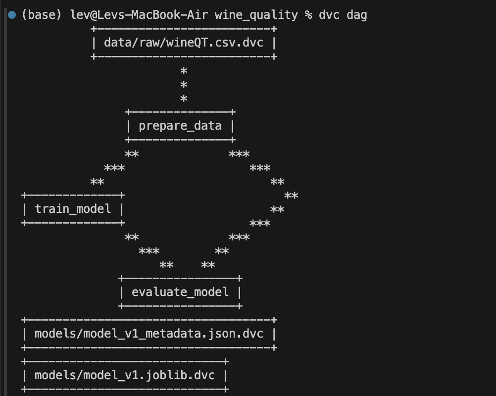
- Реализовано кэширование и параллельное выполнение: DVC автоматически кэширует результаты каждого этапа 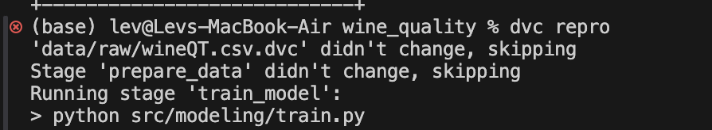

#### 2. Настройка выбранного инструмента конфигураций: Pydantic
- Установлен и настроен Pydantic
``` poetry add pydantic ```
- Созданы [конфигурации для разных алгоритмов](src/config/schemas.py)
- Настроена валидацию конфигураций 
- Создана систему [композиции конфигураций](src/modeling/train.py)
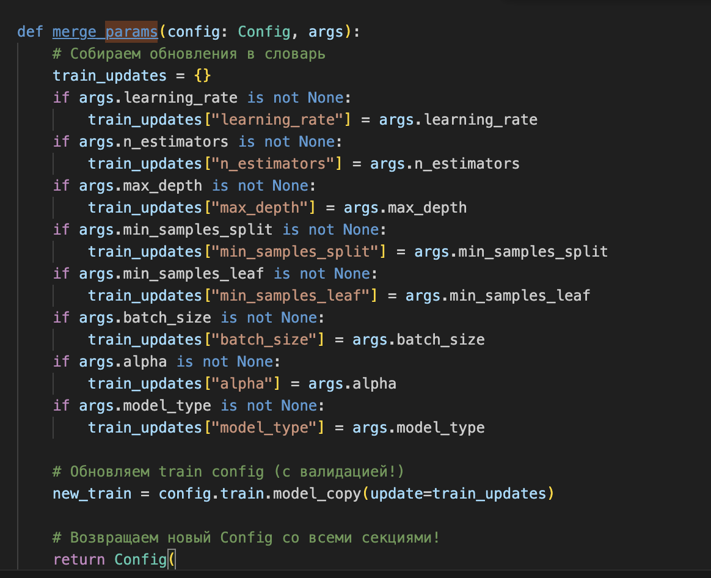

#### 3.Интеграция и тестирование :
- Интегрирован выбранный инструмент в Python код
- Создана система мониторинга выполнения
- Настроены уведомления о результатах - отправляются в wandb 
- Протестирована воспроизводимость

#### 4. Отчет о проделанной работе


--------
## ДЗ5
### Отчет о ClearML для MLOps
#### 1. Настройка ClearML:
- Установлен и настроен ClearML Server
  - Склонирован репозиторий ```git clone https://github.com/clearml/clearml-server.git```
  - Поднят docker образ ```docker-compose up```
- Настроена база данных и хранилище
  - подняты 6 сервисов clearml-mongo (MongoDB), clearml-elastic (Elasticsearch), clearml-redis (Redis), clearml-server (API Server, порт 8008), clearml-fileserver (File Server, порт 8081), clearml-webserver (Web UI, порт 8080)
  - MongoDB для хранения метаданных экспериментов и моделей
  - Elasticsearch для поиска и индексации
  - Redis для кэширования и очередей задач
  - File Storage через clearml-fileserver для хранения артефактов и моделей
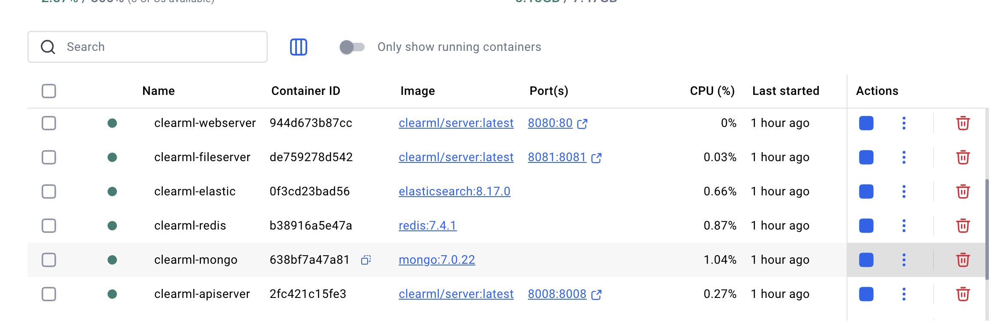
- Созданы проекты и эксперименты
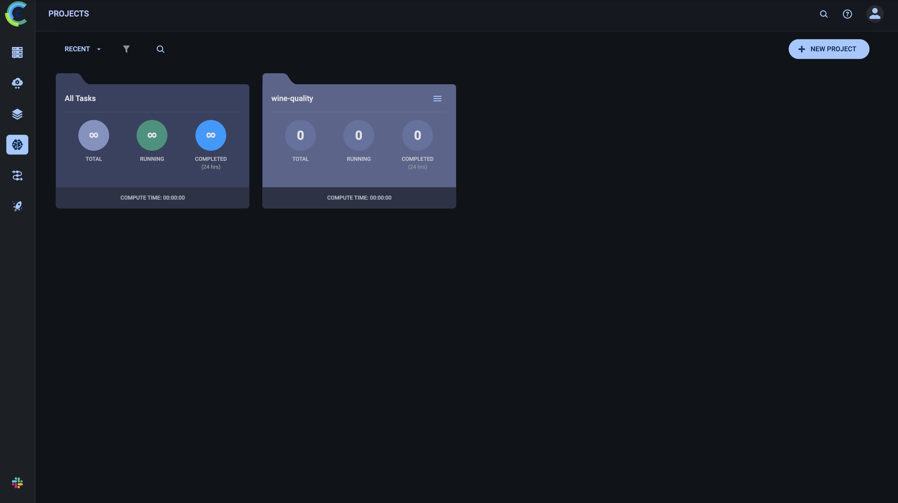
- Настроена аутентификация
```clearml-init```


#### 2. Трекинг экспериментов:
- Настроено автоматическое логирование 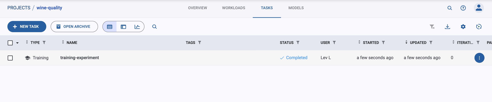
- Создана систему сравнения экспериментов 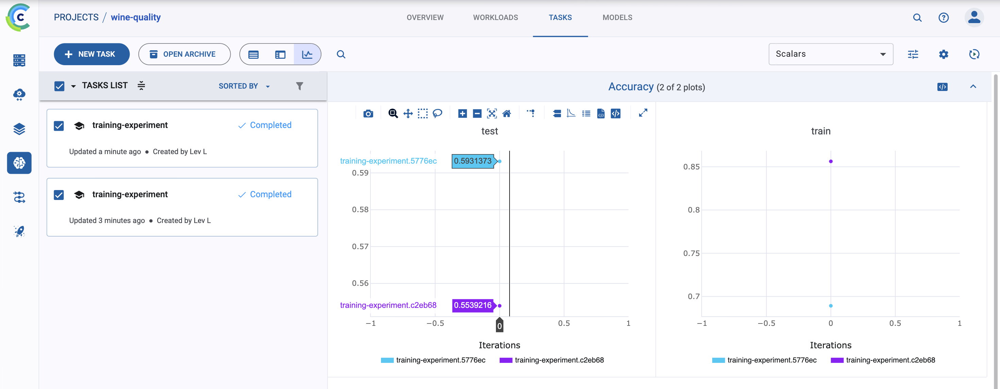
- Настроено логирование метрик и параметров 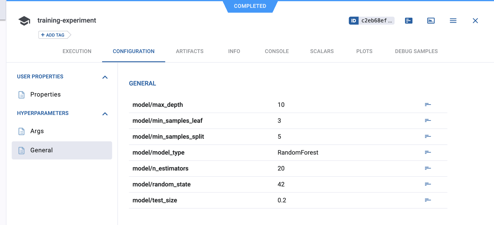
- Созданы дашборды для анализа

#### 3.Управление моделями:
- Настроена регистрация и версионирование моделей 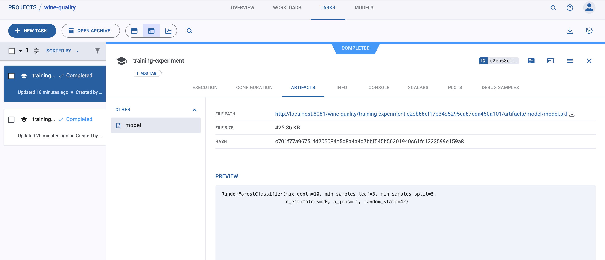
- Создана систему метаданных для моделей 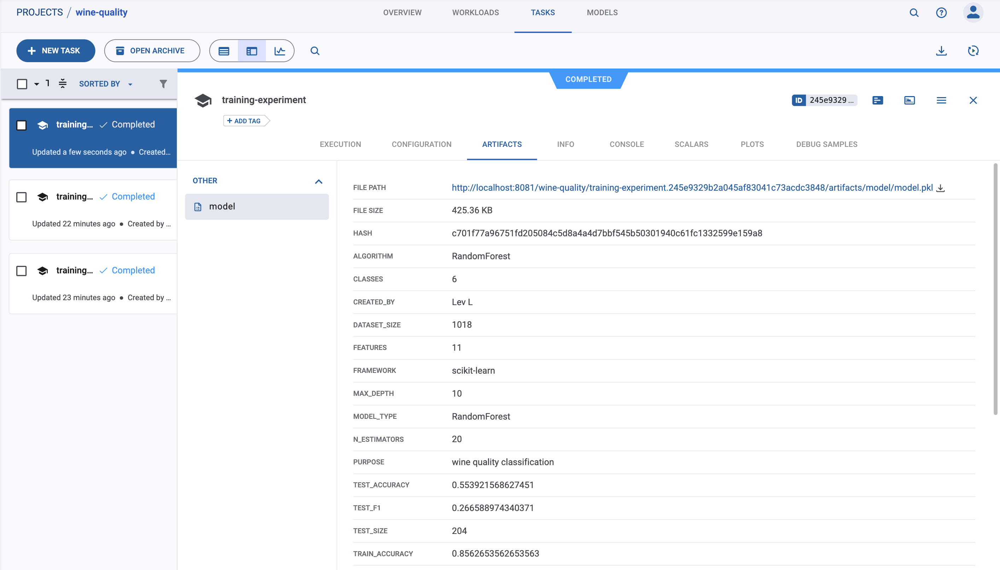
- Настроено автоматическое создание версий: каждый запуск создает новую версию 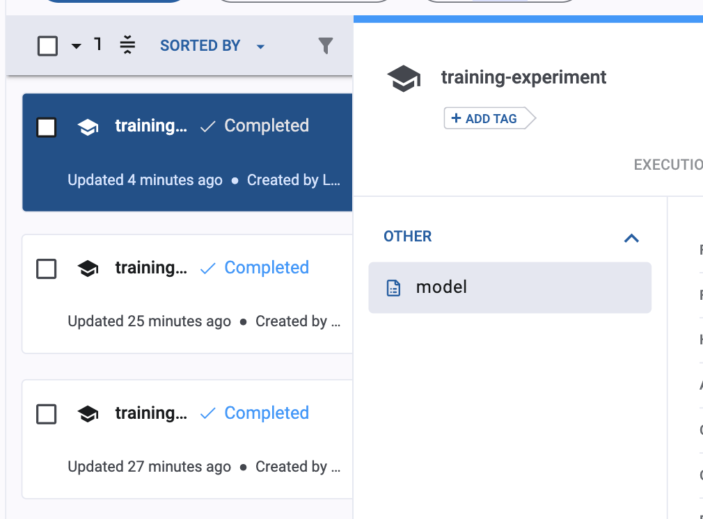
- Создана систему сравнения моделей

#### 4. Пайплайны
- Создан ClearML пайплайны для ML workflow 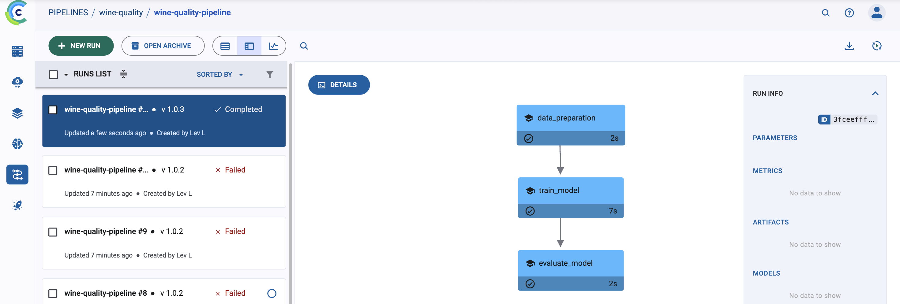
- Настроен автоматический запуск пайплайнов [schedule_pipeline](src/schedule_pipeline.py)
- Создана систему мониторинга выполнения
- Настроены уведомления

#### 5. Отчет о проделанной работе


--------
## ДЗ6
### Документация и отчеты
#### 1. Техническая документация:
- Создана документацию с помощью MkDocs
```
poetry add mkdocs mkdocs-material mkdocstrings mkdocstrings-python
mkdocs serve
```
- Создано [руководство по развертыванию](https://levliv.github.io/mlops/)
- Настроена автоматическая генерация документации
- Созданы примеры использования

#### 2. Публикация в Git Pages:
- Настроены [GitHub Actions](.github/workflows/docs.yml) для автоматической публикации

- Создан сайт с документацией на [Git Pages](https://levliv.github.io/mlops/)
- Настроено автоматическое обновление при изменениях

#### 3.Отчеты об экспериментах:
- Созданы отчеты об экспериментах в формате Markdown
  - Пример сгенерированной документации 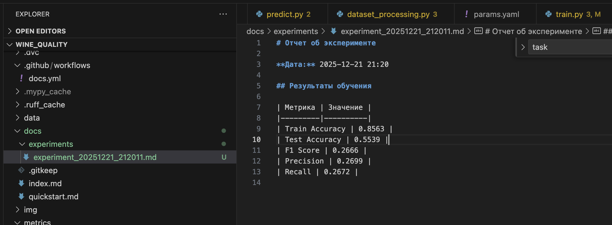
- Добавлены графики и визуализации результатов 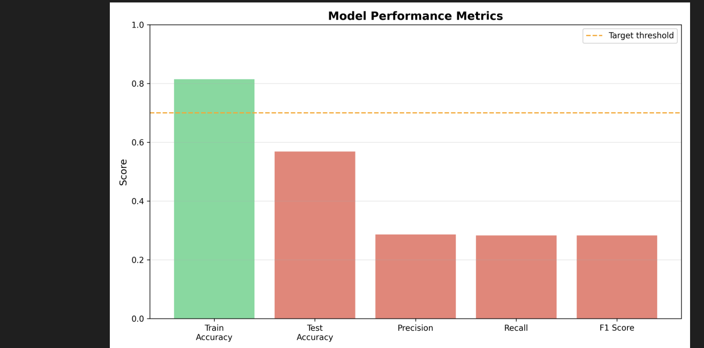
- Созданы сравнительные таблицы экспериментов 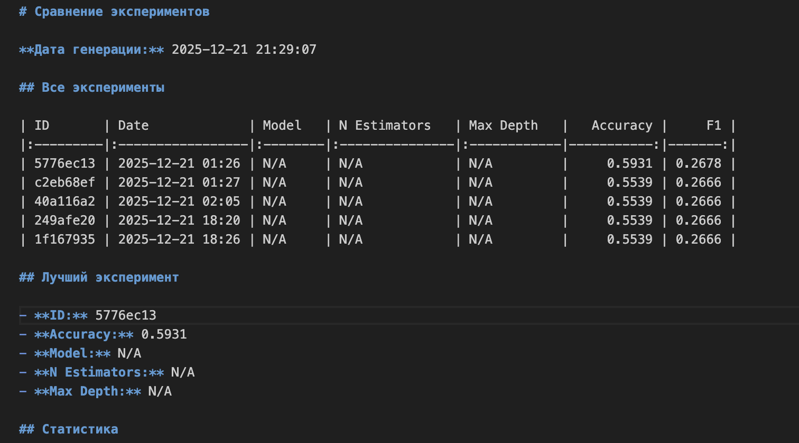
- Настроена автоматическая генерация отчетов: [генератор](reports/generate_report.py)

#### 4. Воспроизводимость
- Создана инструкция по воспроизведению
- Создан README с полным описанием
- Настроена автоматическая сборка документации
